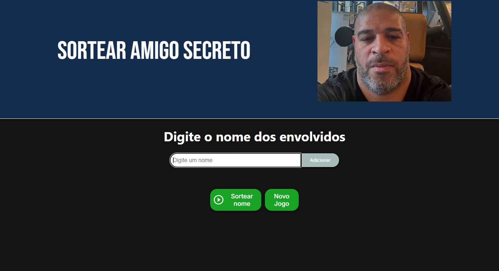

# 🎉 Challenge Amigo Secreto

## 📌Descrição do Projeto
O Challenge Amigo Secreto é um desafio de prática de lógica de programação do programa Oracle Next Education que estou companhando pela plataforma Alura. O objetivo principal é aplicar de forma prática os conhecimentos adquiridos nos cursos iniciais da formação ONE: 

- Lógica de programação: mergulhe em programação com JavaScript;

- Lógica de programação: explore funções e listas;

- ChatGPT: otimizando a qualidade dos resultados;

- Git e GitHub: compartilhando e colaborando em projetos;

## 🔗 Acesse o Projeto
[Projeto Amigo Secreto - Vercel](https://paulo-jogo-amigo-secreto.vercel.app/)

## 🚀 Funcionalidades

- ✅ Adicionar nomes para o sorteio.

- 🚫 Impedir nomes duplicados ou campos vazios.

- 👀 Exibir a lista de nomes inseridos.

- 🎨 Interação visual ao passar o mouse sobre os botões.

- 🔄 Botão "Novo Jogo" para reiniciar o sorteio.

- 📜 Exibir o nome sorteado de forma destacada.

- 🖼️ Alteração dinâmica da imagem ao sortear um amigo secreto.

## 📌 Tela Inicial Site

## 🛠️ Tecnologias Utilizadas 
    

## 👨‍💻 Autor
- **Paulo Cavalcante Caroba** - Desenvolvedor principal. [Linkedin](https://www.linkedin.com/in/paulocavalcantec/)
- **Modelo base**: O projeto tem como base um repositório fornecido pelo curso no site da Alura.

## 💙 Agradecimentos

- Agradeço ao programa Oracle Next Education (ONE) e à plataforma Alura pela oportunidade de aprender;
- Agradeço também à comunidade de desenvolvedores do fórum Alura por todo o suporte e conhecimento compartilhado.