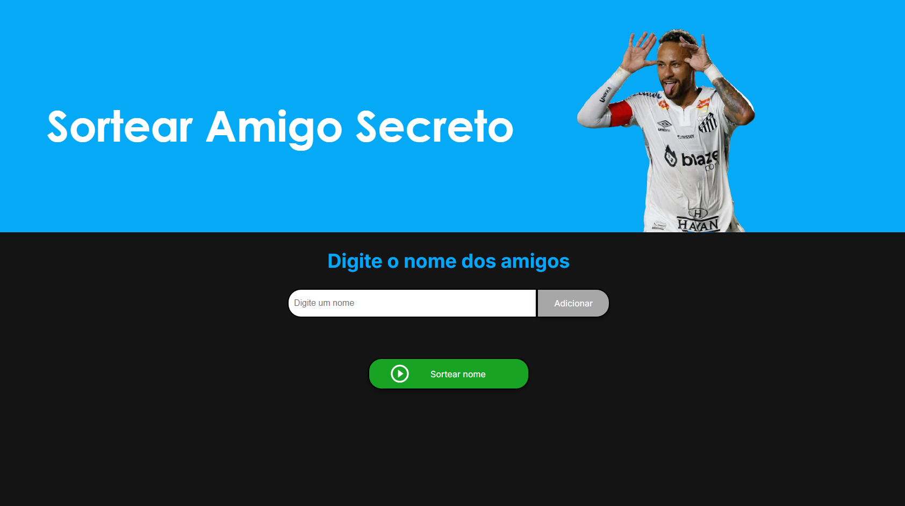
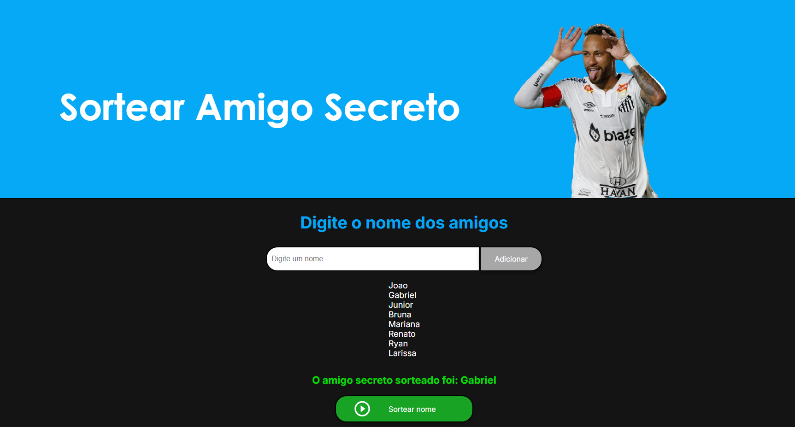

## Descrição do Projeto
O Challenge Amigo Secreto é um desafio de prática de lógica de programação do programa Oracle Next Education que estou companhando pela plataforma Alura. O objetivo principal é aplicar de forma prática os conhecimentos adquiridos nos cursos iniciais da formação ONE: 
- Lógica de programação: mergulhe em programação com JavaScript;
- Lógica de programação: explore funções e listas;
- ChatGPT: otimizando a qualidade dos resultados;
- Git e GitHub: compartilhando e colaborando em projetos;

## Funcionalidades

- É possível digitar os nomes que serão utilizados no sorteio;
- O programa impede nomes duplicados e campos de digitação vazios;
- Durante execução do programa, podem ser visualizados os nomes digitados;
- O botão de sorteio tem interação visual, e muda de cor quando o cursor do mouse passa por cima dele.
## Acesse o Projeto
[Projeto Amigo Secreto - Vercel](https://paulo-jogo-amigo-secreto.vercel.app/)

## Tela Inicial Site

## Exemplo de Sorteio Finalizado

## Tecnologias Utilizadas 
    

## Autores
- **Paulo Cavalcante Caroba** - Desenvolvedor principal. [Meu Linkedin](https://www.linkedin.com/in/paulocavalcantec/)
- **Modelo base**: O projeto tem como base um repositório fornecido pelo curso no site da Alura.

## Agradecimentos

- Agradeço ao programa Oracle Next Education (ONE) e à plataforma Alura pela oportunidade de aprender;
- Agradeço também à comunidade de desenvolvedores do fórum Alura por todo o suporte e conhecimento compartilhado.